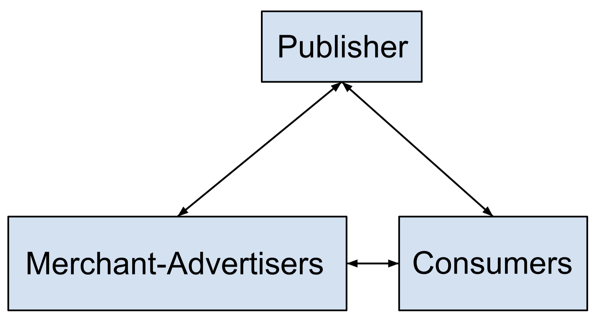
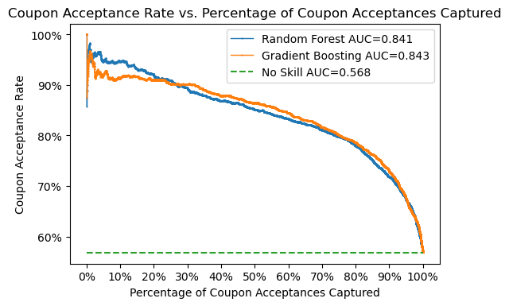
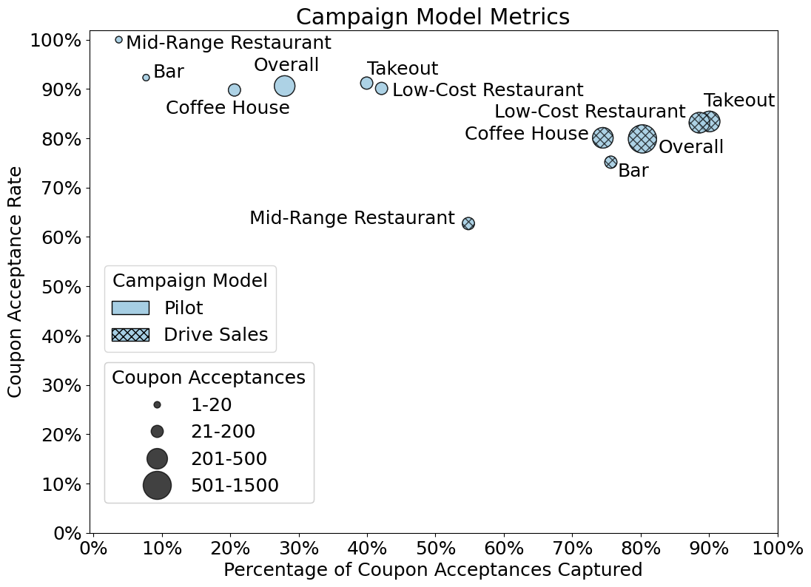
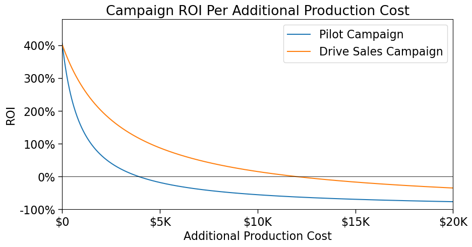
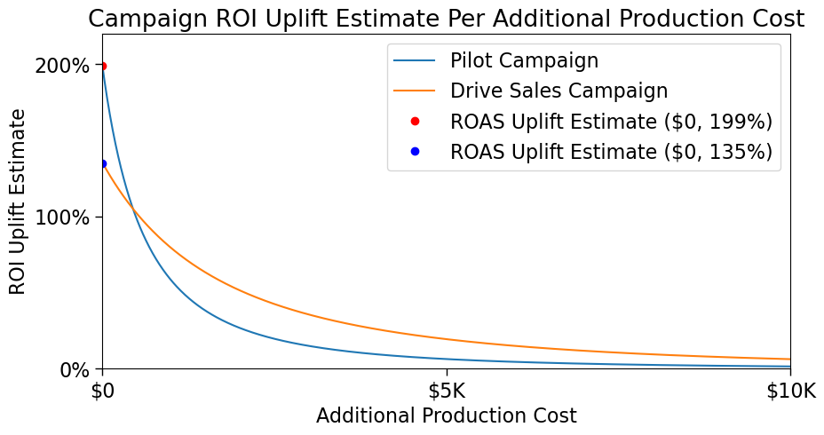
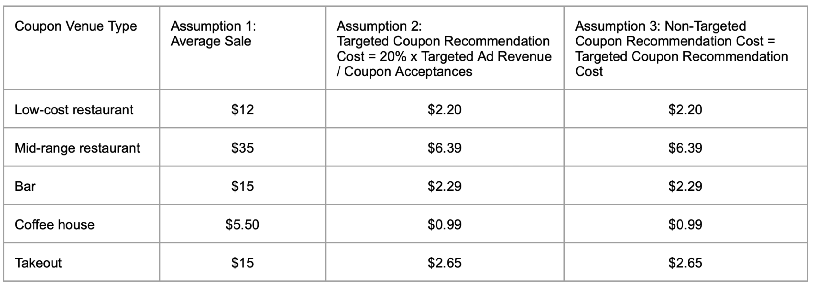

[Front Page]() | [DSCapstone1](https://pauljacob.github.io/DSCapstone1/) | [DSCapstone2](https://pauljacob.github.io/DSCapstone2/)

Left image credit: [website](). Right image credit: [Wang et al](https://jmlr.org/papers/volume18/16-003/16-003.pdf)

# In-Vehicle Coupon Recommendation

## Executive Summary

*From 2537 survey scenario responses, our random forest estimated an overall food and dining merchant-advertiser 199% ROAS uplift at a 91% coupon acceptance rate and 28% of coupon acceptances captured.*

## 1. The Problem

Food and dining merchant-advertisers want to cost effectively reach consumers with coupons to drive sales to their venue.

Publisher: supply an ad space service for merchant-advertisers that serves ads to consumers via our mobile app.  
Merchant-advertiser: food & dining businesses, e.g., takeout, coffee houses, bars, low-cost restaurants, and mid-range restaurants.  
Consumers: USA vehicle drivers with a smartphone (estimated at 182 million individuals).  

## 2. The Solution
We the publisher provide the platform for merchant-advertisers to efficiently reach in-vehicle drivers. Using ML models and some assumptions, we estimated the expected campaign performance metrics.

## 3. The Data

Our data was the Amazon Mechanical Turk survey scenario responses dataset. It's made up of 654 survey participants and represents a sample of the population which we defined as drivers in the USA with a mobile smart device.

> * In-Vehicle Coupon Recommendation Scenario Response Survey Dataset: [UCI Machine Learning Repository](https://archive.ics.uci.edu/dataset/603/in+vehicle+coupon+recommendation)

## 4. ML Model Comparison

In the figure below, we see the coupon acceptance rate vs percentage of coupon acceptances captured plot for the random forest and gradient boosting ML models.

Using some assumptions, we concluded the following:

• For the purpose of higher ROAS uplift and coupon acceptance rate, the better ML model is the random forest.

• For the purpose of higher percentage of coupon acceptances captured and ROI dropoff resistance to additional production cost, the better ML model is the gradient boosting.

## 5. Campaign Model Metrics

In running our pilot campaign model, we found the takeout, coffee house, and low-cost restaurant merchant-advertisers showed preferred performance with good coupon acceptance rate, percentage of coupon acceptances captured, and coupon acceptances. The bar and mid-range restaurant merchant-advertisers were with good coupon acceptance rate, but with lesser percentage of coupon acceptances captured and coupon acceptances.

Making further assumptions on the average sale, targeted coupon recommendation cost, and non-targeted coupon recommendation cost per coupon venue type, we measured ROAS and ROI.

:-------------------------:|:-------------------------:
  |  

## 2. Method

Our objective was to determine whether to recommend. The ramifications in attempting to answer this question led us to decide between the following models:

1. Build a regression model for predicting spread. Then build a simple policy for betting on NBA games (to return accuracy and ROI).

2. Build a classification model for predicting winning and losing bets.

Because the regression model gave us more granularity, interpretability, and the option to create a confidence interval of predictions, the regression model was favored over the classification model.

## 3. Data Cleaning 

In this project, we selected the 2010-11 thru 2017-18 seasons for prediction. This is because of our datasets and features, these seasons were in common. Below, we describe some of the data cleaning process.

* **Problem 1:** NBA player names were sometimes not consistent with a team, date, or league. Also, names were sometimes different between the injury, inactive player,  and advanced stats datasets. We wanted the player-level stats to create ‘lost contribution’ features. While cleaning this player name data manually was done, many of these players did not show up in our top features for predictive importance. Maybe In the future, the less impactful players can be ignored.

* **Problem 2:** Game Stats contained game id’s with estimated game dates and conflicted with other the boxscore dataset game dates. Preference was given to the boxscore dataset with fewer missing dates and were not stated as estimates.

* **Problem 3:** Team names were not consistent across datasets and team city, name, or abbreviates sometimes changed between seasons. We wanted to create team matchup stats that were easy to interpret without having to memorize team_id. Team abbreviation was determined as the easiest human readable team identifier. 

## 4. EDA

## 5. Algorithms & Machine Learning

Random Forest Regression was used from the scikit-learn library and performed the best among Gradient Boosting and Select K-best Linear Regression. In addition, the Random Forest Regression scikit-learn library provided Gini importance per feature which allowed us to narrow our 800+ features to under 100.  

>***NOTE:** Here, the first 90% of games were used to predict the last 10% of games. Also, Mean Absolute Error (MAE) is the criterion used in our Random Forest Regression model. Preference is given to the MAE metric because we want the number of points away our predicted spread is from the actual spread and to minimize it.*

**WINNER: Random Forest Regressor**

grid_params = { 
        'randomforestregressor__n_estimators': [200], 
        'randomforestregressor__max_depth': [10], 
        'randomforestregressor__min_samples_split': [100] 
}

## 6. How “Good” Is Our Model?

In comparing our MAE to that of the sportsbooks, we achieved an MAE of 9.7 while that of the book was 9.3. Knowing that we did not beat the sportsbook model metric MAE, we were forced to ask how useful is a seemingly inferior model?

To answer this, we decided to make a simple betting policy that attempted to give a good ROI while minimizing risk. One of the features we created for this task is the confidence interval for predicted spread. This was done by taking the bootstrap n=8 mean of Random Forest decision tree predictions. Below is an example spread distribution for an NBA game.

In addition to the spread confidence interval, we created sportsbook betting features  price break even and the absolute value of spread.

## 7. Betting Policy

Taking our three new features, we ran combinations of them as betting policy criteria from and on folds 1 thru 7. We collected the top performing policy criteria which turned out to be 5%. The most frequently occurring criterion values were selected and checked for performance on fold 8.
 

## 8. Betting Policy Outcomes

Using the same process for betting policy selection on folds 1 thru 8, the same was done on folds 1 thru 8 and checked on fold 9. The results below show that by adjusting the betting size, we adjusted our risk tolerance. From left to right we have a risk tolerance of 5, 2, and 1, where 5 is the maximum losing streak on the train folds 1 thru 8 as a percentage of the total initial number of bets available.

## 9. Future Improvements

* While in hyperparameter tuning, 5-fold cross-validation produced a “good” model, time series cross-validation would be more suited for a production model. This is because it avoids the potential overfitting of using future data to predict past data. 

* Also, adding more features like names of game officials and quarter by quarter stats could give more insight into the random forest model and potentially yield a better MAE.

* While selecting a simple betting policy was done as a heuristic, exploring potential machine learning solutions may help if going beyond a simple policy is desired.

## 10. Credits

Thanks to the pandas and sklearn developers for an excellent data science toolkit and Blake from Springboard for his insightful guidance on this project.

References
[1] 
[2] A Bayesian Framework for Learning Rule Sets for Interpretable Classification, https://jmlr.org/papers/volume18/16-003/16-003.pdf

## Appendix

Pilot Campaign Model Assumptions

[Go to My Image](#my-image)

